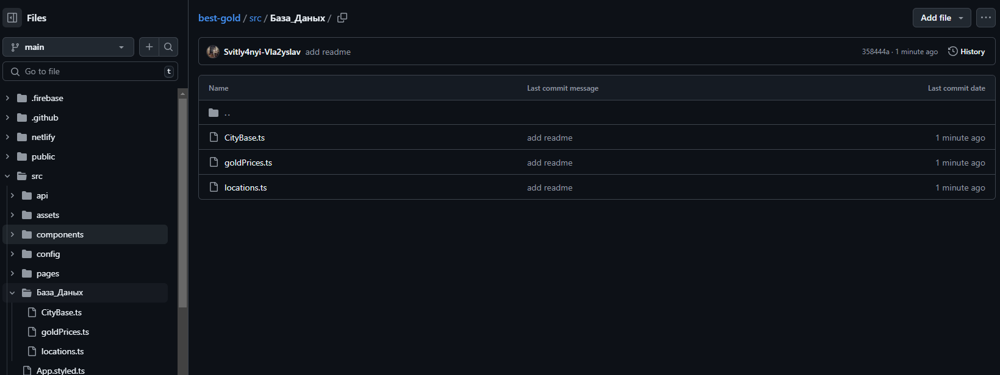
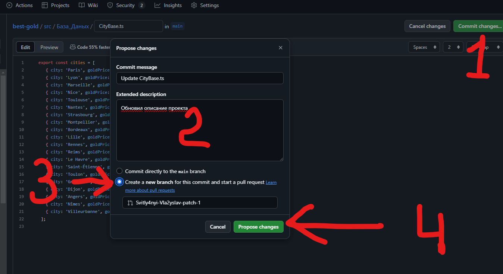

# Инструкция по регистрации и работе с GitHub

##  Регистрация на GitHub

1. **Перейдите на сайт GitHub**
   - Откройте веб-браузер и в адресной строке введите [https://github.com](https://github.com).
   
2. **Начните процесс регистрации**
   - На главной странице нажмите кнопку **"Sign up"** (Зарегистрироваться).
   
3. **Заполните данные для регистрации**
   - Введите **email-адрес**.
   - Придумайте и введите **пароль**.
   - Введите **имя пользователя** (username), которое будет вашим публичным идентификатором.
   - Нажмите **"Continue"** (Продолжить).
   
4. **Подтвердите почтовый ящик**
   - GitHub отправит вам письмо с кодом подтверждения на указанный email.
   - Перейдите в свою почту, откройте письмо и скопируйте код.
   - Вставьте код в поле на странице регистрации и нажмите **"Continue"**.

5. **Завершите настройку аккаунта**
   - GitHub задаст несколько вопросов о ваших предпочтениях.
   - Вы можете пропустить эти вопросы, нажав **"Skip personalization"**.

6. **Готово!**
   - Теперь у вас есть аккаунт на GitHub, и вы можете приступить к работе.

---

##  Как редактировать файлы прямо на GitHub

1. **Откройте файл, который хотите изменить**
   - Перейдите в репозиторий и найдите папку (**src/База_Даных**) 
   
   там у вас будет 3 файла в которих находятся ✍️
   - locations.ts геолокации ваших партнеров 
   - goldPrices.ts таблица з ценами, типом метала, каратами .
   - CityBase.ts поисковик которий стоит сверху предназначен для поиска в конкретном городе информации о цене от ваших партнеров. 
   - Нажмите на название файла, чтобы его открыть.

2. **Начните редактирование файла**
   - Нажмите на значок **"Edit this file"** (карандашик) в правом верхнем углу.
   
   - Файл откроется в режиме редактирования.

3. **Внесите изменения**
   - Отредактируйте текст по необходимости.
   - Можно добавлять заголовки, текст или форматирование (например, **жирный текст** или *курсив*).

4. **Сохраните изменения**
   - В верху будет **"Commit changes"** нажмите на него.
   - В поле **"Commit changes"** введите краткое описание изменений (например, "Обновил описание проекта").
  
   - Выберите опцию **Create a new branch for this commit and start a pull request**.
   
   - Нажмите на кнопку **"Commit changes"**.

5. **Изменения сохранены**
   - Вы вернетесь на страницу репозитория, и я ваши изменения сохраню.

---

##  Как работать с репозиторием как приглашённый Collaborator

1. **Получите приглашение**
   - После того как вас пригласят в репозиторий, на ваш email придёт письмо от GitHub с заголовком **"You’ve been invited to collaborate on a repository"**.
   - Откройте письмо и нажмите на кнопку **"View invitation"** (Просмотреть приглашение).

2. **Примите приглашение**
   - На открывшейся странице нажмите кнопку **"Accept invitation"** (Принять приглашение).
   - Теперь у вас есть доступ к репозиторию.

3. **Редактирование файлов**
   - Перейдите в репозиторий и выберите нужный файл.
   - Нажмите на значок **"Edit this file"** (карандашик) для редактирования.
   - После внесения изменений нажмите **"Commit changes"**.

4. **Добавление новых файлов**
   - Нажмите **"Add file"** и выберите **"Create new file"** или **"Upload files"**, чтобы добавить новый файл.
   - Внесите изменения и сохраните их через **"Commit changes"**.

---

Поздравляю! Теперь вы умеете:
- Регистроваться на GitHub;
- Редактировать и добавлять файлы прямо на GitHub;
- Работать с репозиторием как Collaborator.

Если у вас возникнут вопросы, обращайтесь ко мне!

